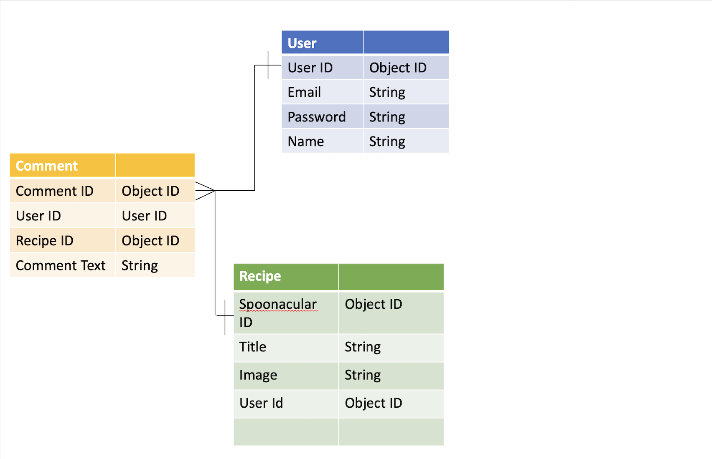

# OVERVIEW

KitchWitch is a react app that allows users to submit ingredients that they have on hand and get recipes based on those ingredients using a third party API Spoonacular.

# Technologies Used:

-Javascript
-React.js
-Express
-MongoDB
-Bootstrap CSS

# User Stories

-As a user, I want to sign up for an account to access KitchWitch.

-As a user, I want to sign out of my KitchWitch account.

-As a user, I want to be able to change my password.

-As a user, I want to log in to my account and see my recipes and comments.

-As a user, I want to search for recipes based on ingredients I have at home already.

-As a user, I want to comment on recipes.

-As a user, I want to see a list of my favorite recipes so I can access it quickly.

# ICEBOX

-As a user, I want to see a list of my favorite recipes so I can access it quickly.

-As a user, I want to delete recipes from my favorites if I am no longer interested in them.

-As a user, I want to rate recipes based on my level of enjoyment.

-As a user, I want to set a timer to ensure correct cook time.

-As a user I want the option to uplad a photo of the dish I have completed.

# ERD



# API/ Authentication

Using Curl Scripts with Postman to test Authentication and CRUD

| Verb   | URI Pattern         | Controller#Action |
| ------ | ------------------- | ----------------- |
| POST   | `/sign-up`          | `users#signup`    |
| POST   | `/sign-in`          | `users#signin`    |
| PATCH  | `/change-password/` | `users#changepw`  |
| DELETE | `/sign-out/`        | `users#signout`   |

#### Recommended Request bodies

Request - users#signup:

```json
{
  "credentials": {
    "email": "an@.email",
    "password": "a password",
    "password_confirmation": "a password"
  }
}
```

### Recipes

| Verb   | URI Pattern            | Controller#Action |
| ------ | ---------------------- | ----------------- |
| GET    | `/recipes`             | `recipes#index`   |
| GET    | `/recipes/<recipe_id>` | `recipes#show`    |
| POST   | `/recipes`             | `recipes#create`  |
| PATCH  | `/recipes/<recipe_id>` | `recipes#update`  |
| DELETE | `/recipes/<recipe_id>` | `recipes#delete`  |

### Comments

| Verb   | URI Pattern                           | Controller#Action |
| ------ | ------------------------------------- | ----------------- |
| POST   | `/comments/<comment_id>`              | `comments#create` |
| PATCH  | `/comments/<comment_id>/<comment_id>` | `comments#update` |
| DELETE | `/comments/<comment_id>/<comment_id>` | `comments#delete` |

### Token Auth Strategy

Send the token as `Bearer Token <token>`

# API/spoonacular third party API to send recipes

```
GET https://api.spoonacular.com/food/ingredients/search?query=banana&number=2&sort=calories&sortDirection=desc

{
    "results": [
        {
            "id": 19400,
            "name": "banana chips",
            "image": "banana-chips.jpg"
        },
        {
            "id": 93779,
            "name": "banana liqueur",
            "image": "limoncello.jpg"
        }
    ],
    "offset": 0,
    "number": 2,
    "totalResults": 13
}
```
